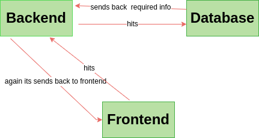

# Social Media Application

## Problem Statement

### To create a social media application to communicate with other people

<br>

## features

- Login/Signup
    - Users should be able to signup with their basic details like:
        - name, mobile number , email , password , DOB , gender , profile picture    
    - After signing up ,users must be able to login
- after logging in ,users must be taken to th **home page** (posts page)
- post page should include      
    - Users can see their posts and also their friends posts here
    - users can add /edit/delete their own posts
        - posts can have images,description,name,hashtags
    - Users can comment/like their posts and also others posts
- Should have a profile page
    - Users can view their own profile details here
    - Users should be able to edit their profile pages
        - like name,DOB,mobile number,gender,profile picture
- Should have a friends page 
    - Users should be able to view their list of friends
    - Users should have the ability to see people who are not freinds and send them friend requests
    - Users should be able to accept the request from others

<br>


### steps/solution

- Mainly used 3 technologies like
    -  backend
    - frontend
    - database
- Authentication
    - ```to verify the users if they are logged in or not to allow them to watch posts,to add posts,and to send friend requests etc,.```
    
## Architectural diagram



<br>

## Technologies used

- NodeJs
   - ```Nodejs is an open-source,cross platform,backend javascript runtime environment that runs on v8 engine and exicutes js code outside a web browser.For adding server side part we use Nodejs. Like connecting to database and posting the data,getting the data ,for deleting the data or adding the data.It has High performance for real-time applications```

- Reactjs
    - ```React is a declarative,efficeint,and flexible javascript library for building user interfaces.it lets you compose complex UI's from small and isolated pieces of called components.For adding client side pages to view like home page ,profile page etc.We can work with different routes easily.By seeing frontend page we can add or delete the posts easily.```

- MongoDB
    - ```Mongodb is a non-relatinal document database that provides support for jSON-like storage.The mongodb database has a flexible data model that enables you to store unstructured data.We use database to store all the data like posts,description,profile data etc.```
<br>

### Users Schema

```
{
    email:string,
    name:string,
    password:string,
    mobile:string,
}
```
### Friendship

```
{
    requester:Schema.Types.ObjectId,ref:Users,
    receipient:Schema.Types.ObjectId,ref:Users,
}
```

### User_post

```
{
    post_id:string,
    profile_id:string,
    written_text:string,
    media_location:url,
    created_datetime:int,
}
```
<br>

### post_like
```
{
    post_id:objectid,
    profile_id:objectid,
}
```
<br>

### post_comment

```{
    post_id:objectid,
    profile_id:objecctid,
    comment:string,
    created_datetime:int,
}
```

<br>

### Nodejs specifications

### you will find the routes list here

<br>

### User Routes

1) #### POST /user/login
​
Request body - 
```
{
    email: string, ( Required )
    password: string, ( Required, Must be atleast 8 characters )
}
```
Response body ( 200 ) - 
```
{
    userDetails: {
        email: string,
        name: string,
        mobile: string,
    }
}
```

​
Response body ( 400 ) - 
```
{
    error: {
        password: string, // Example - password: "must be atleast 8 characters"
    }
}
```

2) #### POST /user/signUp
​
Request body - 
```
{
    username:string,(Required)
    email: string, ( Required )
    password: string, ( Required, Must be atleast 8 characters )
}
```
Response body ( 200 ) - 
```
{
    navigate to "user/login/" page
    userDetails: {
        email: string,
        name: string,
        mobile: string,
    }
}
```

​
Response body ( 400 ) - 
```
{
    error: {
        password: string, // Example - password: "must be atleast 8 characters"
    } 
    error:{
        email:String, // give a correct email adress
    }
}
```

3) #### User/posts

Request body-
```
{
    photo:[string],
    description: string, (required),
    comment:string
}
```
Response body(200)-
```
{
    userPosts: {
        photo: string,
        description: string,
        comment:string
    }
}
```
Response body(400)-
```
{
    error: {
        type: string, // no posts yet
    }
}
```

​
<br>
​
### React specifications
​
- Login Page
    - Feature to enter email,password and login
- Home page
    - to represent posts,comments and likes
- Signup page
    - we need to add email,username,mobile number,password
- profile 
    - to add and edit the profile info like changing photo,name etc.
- friends page
    - we can see all our friends list here and some suggestions based on our friends list.